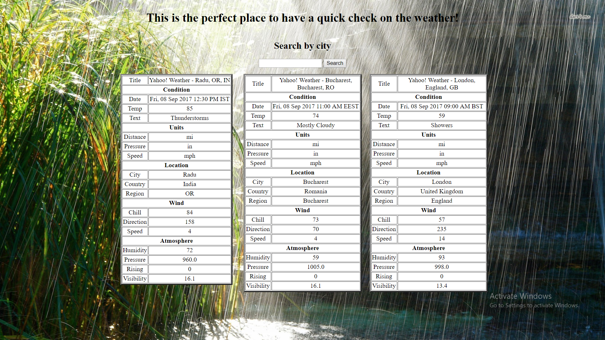

# QuickCheckOnWeather

This application allows you to have a quick check on weather for the current day in a specific city.
You will find information about the condition, temp, about the units used, location, wind and atmosphere.
It is designe to be user 

*What made me code this application?

I like taking decisions on the spot. Sometimes I just feel like embarking on a journey and travel to places I have never been before. This application aim is to make the job of searching for the forecast much easier. You can quickly check on the weather in different cities and compare the data so you can better choose your next destination.

*Technologies used: HTML, CSS, JAVASCRIPT, jQUERY.

